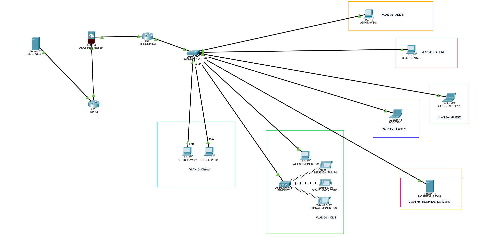

# CareLink Medical Center — Secure Hospital Network Architecture

Healthcare cybersecurity lab demonstrating network segmentation, IoMT isolation, least-privilege access control, perimeter firewalling, and controlled Internet connectivity using Cisco Packet Tracer.



## Overview

CareLink Medical Center is a fictional healthcare environment designed to demonstrate how enterprise networking and cybersecurity controls can be applied to a hospital setting.

The network separates clinical workstations, IoMT devices, administrative systems, billing systems, security operations, guest devices, and hospital servers into dedicated security zones.

The project combines traditional enterprise networking with healthcare-focused security concepts including medical-device segmentation, restricted lateral movement, guest isolation, and perimeter protection.

## Key Capabilities

- VLAN-based network segmentation
- 802.1Q trunking
- Router-on-a-Stick
- DHCP
- Wired and wireless IoMT connectivity
- ACL-based least privilege
- Guest isolation
- IoMT isolation
- Cisco ASA perimeter firewalling
- Static routing
- NAT/PAT
- Controlled Internet connectivity
- Security validation and troubleshooting

## Network Segments

| VLAN | Zone | Network | Gateway |
|---:|---|---|---|
| 10 | Clinical | `192.168.10.0/24` | `192.168.10.1` |
| 20 | IoMT | `192.168.20.0/24` | `192.168.20.1` |
| 30 | Administration | `192.168.30.0/24` | `192.168.30.1` |
| 40 | Billing | `192.168.40.0/24` | `192.168.40.1` |
| 50 | Security | `192.168.50.0/24` | `192.168.50.1` |
| 60 | Guest | `192.168.60.0/24` | `192.168.60.1` |
| 70 | Hospital Servers | `192.168.70.0/24` | `192.168.70.1` |

## Healthcare Security Controls

### Guest Isolation

Guest endpoints are segmented into VLAN 60 and cannot initiate communication with internal hospital networks.

The Guest ACL blocks access to:

- Clinical
- IoMT
- Administration
- Billing
- Security
- Hospital Servers

### IoMT Least Privilege

IoMT devices are placed in VLAN 20 and restricted from initiating connections to Administration, Billing, and Security networks.

Approved communication remains available to Clinical systems and the Hospital Server.

This models the idea that a compromised medical device should not automatically gain broad internal reachability.

### Perimeter Security

The hospital network is separated from the simulated Internet by a Cisco ASA firewall.

Internal hospital systems can initiate approved outbound traffic while external systems cannot freely initiate connections toward internal hospital resources.

## IoMT Environment

The simulated IoMT zone includes both wired and wireless devices:

- `PATIENT-MONITOR01`
- `INFUSION-PUMP01`
- `SIGNAL-MONITOR01`
- `SIGNAL-MONITOR02`

Wireless devices connect through `AP-IOMT01` and are bridged into VLAN 20.

## Security Validation

The network was tested using positive and negative controls.

Examples include:

| Test | Expected | Result |
|---|---|---|
| Clinical → Hospital Server | Allow | PASS |
| Guest → Clinical | Deny | PASS |
| Guest → IoMT | Deny | PASS |
| Guest → Hospital Server | Deny | PASS |
| IoMT → Administration | Deny | PASS |
| IoMT → Billing | Deny | PASS |
| IoMT → Security | Deny | PASS |
| IoMT → Clinical | Allow | PASS |
| IoMT → Hospital Server | Allow | PASS |
| Hospital → Public Web Server | Allow | PASS |
| Public Web Server → Hospital Server | Deny | PASS |

See [`docs/test-matrix.md`](docs/test-matrix.md) for the full validation matrix.

## Troubleshooting Highlight

During perimeter testing, internal hospital traffic successfully reached the simulated public server, but return traffic was dropped at the ASA.

Packet Tracer Simulation Mode was used to trace the packet hop-by-hop and identify the firewall as the failure point.

The issue was resolved using a narrowly scoped access-control rule required by the Packet Tracer ASA simulation.

This troubleshooting process reinforced the importance of validating:

1. Layer 2 connectivity
2. Layer 3 routing
3. NAT/PAT
4. Firewall policy
5. Return-path behavior

See [`docs/troubleshooting.md`](docs/troubleshooting.md).

## Repository Structure

```text
packet-tracer/  Cisco Packet Tracer project
configs/        Cisco device configurations
docs/           Architecture, security controls, threat model, validation, troubleshooting
diagrams/       Logical network diagrams
screenshots/    Security validation evidence
