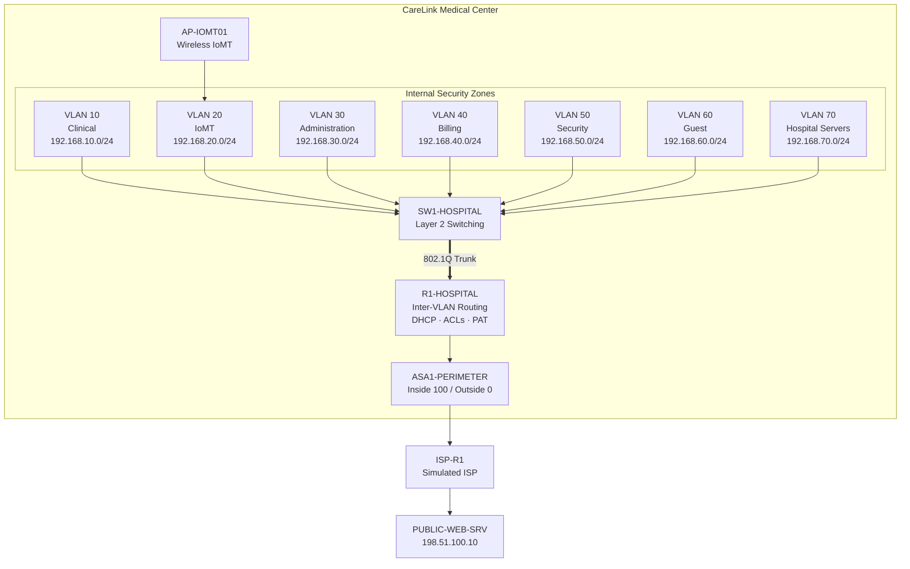
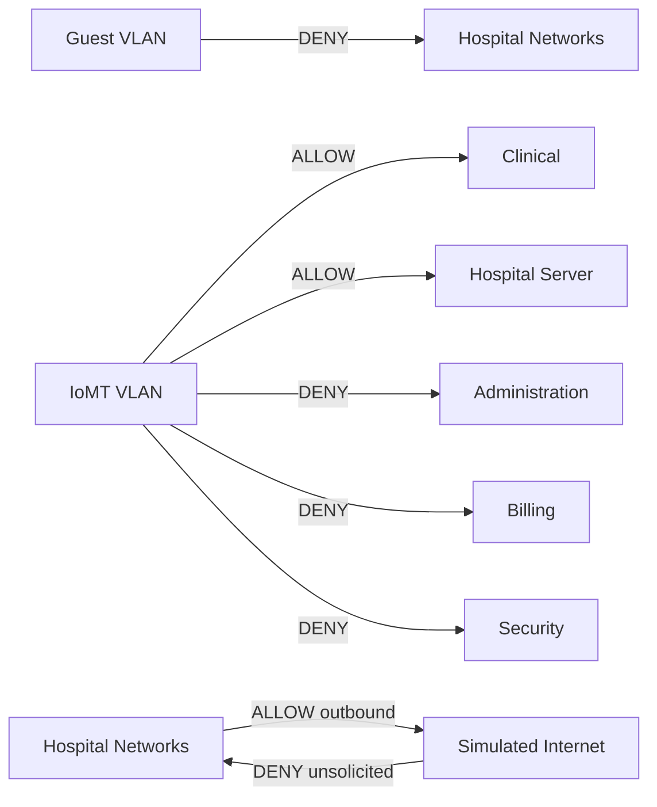
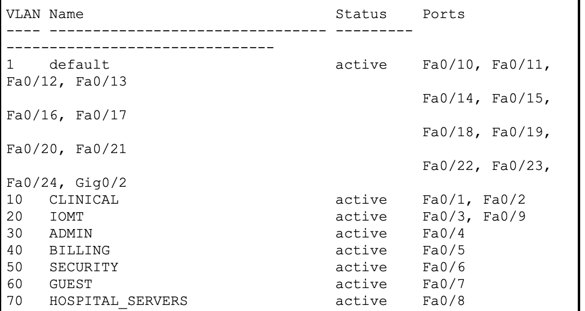
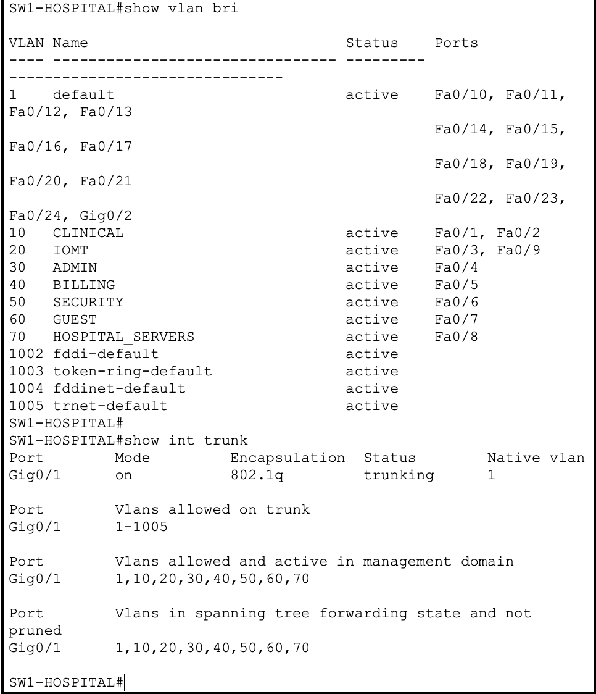
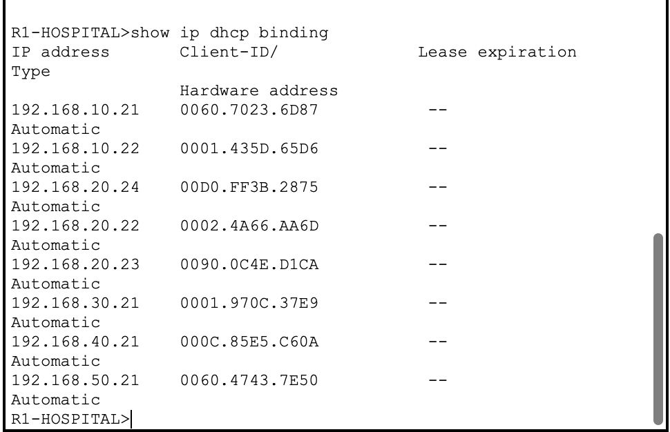
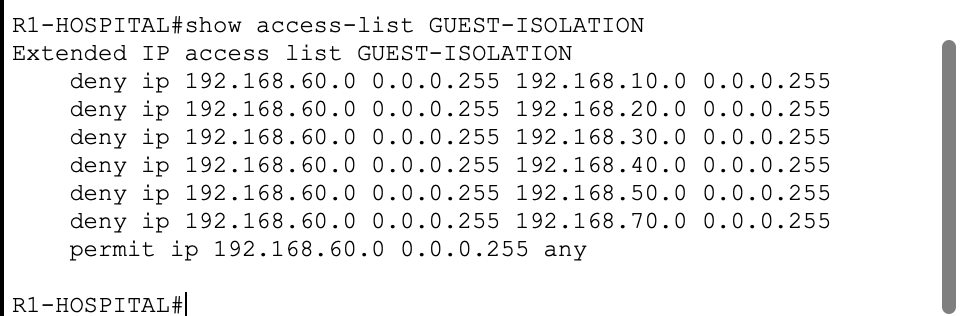
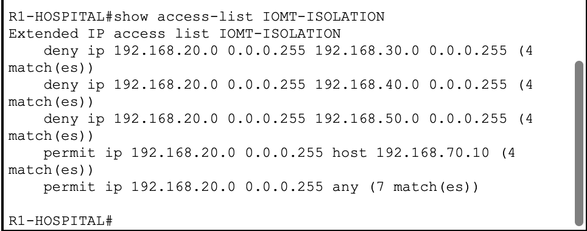
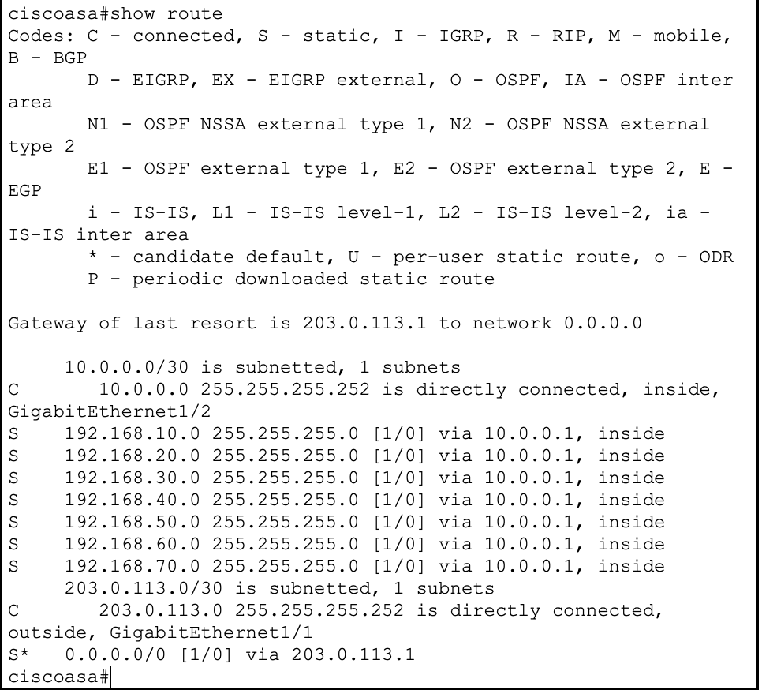
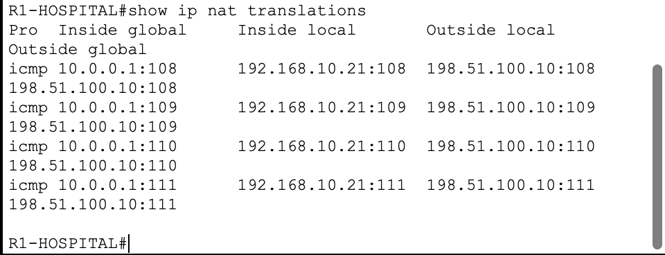
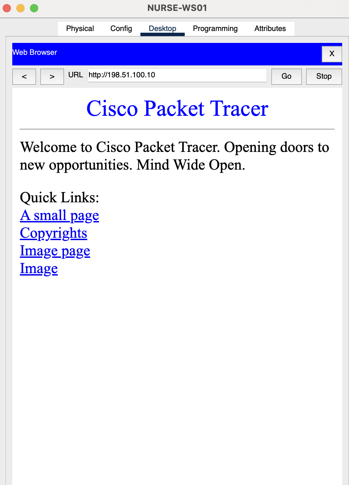

<div align="center">

# CareLink Medical Center
## Secure Hospital Network Architecture

**Healthcare cybersecurity lab focused on network segmentation, IoMT isolation, least-privilege access control, perimeter firewalling, and controlled Internet connectivity.**

<p>
  
  
  
  
</p>

**[Architecture](docs/architecture.md) · [Security Controls](docs/security-controls.md) · [Threat Model](docs/threat-model.md) · [Validation](docs/test-matrix.md) · [Troubleshooting](docs/troubleshooting.md)**

</div>

---

## Project Overview

CareLink Medical Center is a fictional healthcare environment designed to demonstrate how enterprise networking and cybersecurity controls can be applied to a hospital setting.

The project separates clinical workstations, medical and IoMT devices, administrative systems, billing systems, security operations, guest devices, and hospital servers into dedicated security zones.

Rather than building only a functional network, the lab focuses on **security boundaries, controlled communication, lateral-movement reduction, and perimeter defense**.

### At a Glance

| Area | Implementation |
|---|---|
| Segmentation | 7 VLAN security zones |
| Inter-VLAN Routing | Router-on-a-Stick |
| Addressing | DHCP + static infrastructure addressing |
| IoMT Connectivity | Wired + wireless medical devices |
| Internal Security | Extended ACLs |
| Perimeter | Cisco ASA 5506-X |
| Internet Access | NAT/PAT |
| Validation | Positive + negative security controls |
| Troubleshooting | Packet-level Simulation Mode analysis |

---

## Architecture



<details>
<summary><strong>View Packet Tracer topology screenshot</strong></summary>

<br>


</details>

---

## Network Segmentation

| VLAN | Security Zone | Network | Gateway |
|---:|---|---|---|
| 10 | Clinical | `192.168.10.0/24` | `192.168.10.1` |
| 20 | IoMT | `192.168.20.0/24` | `192.168.20.1` |
| 30 | Administration | `192.168.30.0/24` | `192.168.30.1` |
| 40 | Billing | `192.168.40.0/24` | `192.168.40.1` |
| 50 | Security | `192.168.50.0/24` | `192.168.50.1` |
| 60 | Guest | `192.168.60.0/24` | `192.168.60.1` |
| 70 | Hospital Servers | `192.168.70.0/24` | `192.168.70.1` |

The VLANs establish Layer 2 separation. Security policy is then enforced at Layer 3 through ACLs and the perimeter firewall.

---

## Healthcare Security Model



### Guest Isolation

Guest endpoints are placed in VLAN 60 and prevented from initiating communication with:

- Clinical
- IoMT
- Administration
- Billing
- Security
- Hospital Servers

This prevents unmanaged guest endpoints from becoming a path into trusted hospital networks.

### IoMT Least Privilege

The IoMT segment contains both wired and wireless simulated medical devices:

- `PATIENT-MONITOR01`
- `INFUSION-PUMP01`
- `SIGNAL-MONITOR01`
- `SIGNAL-MONITOR02`

Wireless medical devices connect through `AP-IOMT01` and enter the network through VLAN 20.

The policy allows required communication to Clinical and Hospital Server resources while denying unnecessary initiation toward Administration, Billing, and Security networks.

---

## Security Controls

| Control | Purpose |
|---|---|
| VLAN Segmentation | Separate systems by function and trust level |
| 802.1Q Trunking | Carry segmented VLAN traffic to the routing layer |
| Router-on-a-Stick | Provide controlled Layer 3 connectivity |
| DHCP | Centralize endpoint addressing |
| Guest ACL | Isolate unmanaged devices |
| IoMT ACL | Reduce medical-device lateral movement |
| ASA Firewall | Establish perimeter security boundary |
| NAT/PAT | Translate private hospital addresses |
| Static Routing | Control internal and external paths |
| Simulation Testing | Validate packet behavior and failure points |

---

## Security Validation

The design was tested with both **positive controls** and **negative controls**.

| Test | Expected | Result |
|---|---|:---:|
| Clinical → Hospital Server | Allow | ✅ PASS |
| Guest → Clinical | Deny | ✅ PASS |
| Guest → IoMT | Deny | ✅ PASS |
| Guest → Hospital Server | Deny | ✅ PASS |
| IoMT → Administration | Deny | ✅ PASS |
| IoMT → Billing | Deny | ✅ PASS |
| IoMT → Security | Deny | ✅ PASS |
| IoMT → Clinical | Allow | ✅ PASS |
| IoMT → Hospital Server | Allow | ✅ PASS |
| Hospital → Public Web Server | Allow | ✅ PASS |
| Public Web Server → Hospital Server | Deny | ✅ PASS |

Full results: **[Security Validation Matrix](docs/test-matrix.md)**

---

## Validation Evidence

<details>
<summary><strong>VLAN segmentation</strong></summary>

<br>



</details>

<details>
<summary><strong>802.1Q trunk verification</strong></summary>

<br>



</details>

<details>
<summary><strong>DHCP bindings</strong></summary>

<br>



</details>

<details>
<summary><strong>Guest isolation ACL</strong></summary>

<br>



</details>

<details>
<summary><strong>IoMT isolation ACL</strong></summary>

<br>



</details>

<details>
<summary><strong>ASA routing</strong></summary>

<br>



</details>

<details>
<summary><strong>NAT/PAT translations</strong></summary>

<br>



</details>

<details>
<summary><strong>Successful outbound web access</strong></summary>

<br>



</details>

---

## Troubleshooting Case Study

One of the most valuable parts of the project was diagnosing a perimeter return-path failure.

### Symptom

Internal hospital clients successfully sent traffic toward the simulated public server, but return traffic did not reach the originating endpoint.

### Investigation

The following were verified independently:

```text
Client → R1                 PASS
R1 → ASA                    PASS
ASA → ISP                   PASS
ISP → Public Server         PASS
Public Server → ISP         PASS
ISP → ASA                   PASS
ASA → Internal Return Path  DROP
```

Packet Tracer Simulation Mode showed the returning packet being discarded at the ASA security boundary.

### Resolution

A narrowly scoped ACL was introduced to accommodate the ASA behavior implemented by Packet Tracer.

The troubleshooting process reinforced the importance of checking **forward paths and return paths separately**, rather than repeatedly changing NAT or routing configuration.

More detail: **[Troubleshooting Notes](docs/troubleshooting.md)**

---

## Repository Structure

```text
carelink-medical-center-network-security/
│
├── README.md
├── SECURITY.md
├── LICENSE
│
├── configs/
│   ├── ASA1-PERIMETER.txt
│   ├── ISP-R1.txt
│   ├── R1-HOSPITAL.txt
│   └── SW1-HOSPITAL.txt
│
├── diagrams/
│   └── carelink-logical-topology.png
│
├── docs/
│   ├── architecture.md
│   ├── security-controls.md
│   ├── test-matrix.md
│   ├── threat-model.md
│   └── troubleshooting.md
│
├── packet-tracer/
│   └── CareLink-Medical-Center-Final.pkt
│
└── screenshots/
```

---

## Skills Demonstrated

<p>
  
  
  
  
  
  
  
</p>

---

## Documentation

| Document | Purpose |
|---|---|
| [Architecture](docs/architecture.md) | Network design and addressing |
| [Security Controls](docs/security-controls.md) | Implemented defensive controls |
| [Threat Model](docs/threat-model.md) | Assets, threats, and mitigations |
| [Validation Matrix](docs/test-matrix.md) | Positive and negative test results |
| [Troubleshooting](docs/troubleshooting.md) | Investigation and lessons learned |

---

## Technologies

`Cisco Packet Tracer` · `Cisco IOS` · `Cisco ASA` · `VLANs` · `802.1Q` · `DHCP` · `ACLs` · `NAT/PAT` · `IPv4 Routing` · `Wireless IoMT`

---

## Scope & Limitations

This project is an educational simulation.

Cisco Packet Tracer does not reproduce every behavior of production Cisco IOS or ASA platforms. The architecture is intentionally simplified and should not be interpreted as:

- a production hospital network design,
- a HIPAA compliance assessment,
- a clinical safety architecture,
- or a complete zero-trust deployment.

---

<div align="center">

### CareLink Medical Center

**Secure networking · IoMT segmentation · healthcare cybersecurity**

</div>
