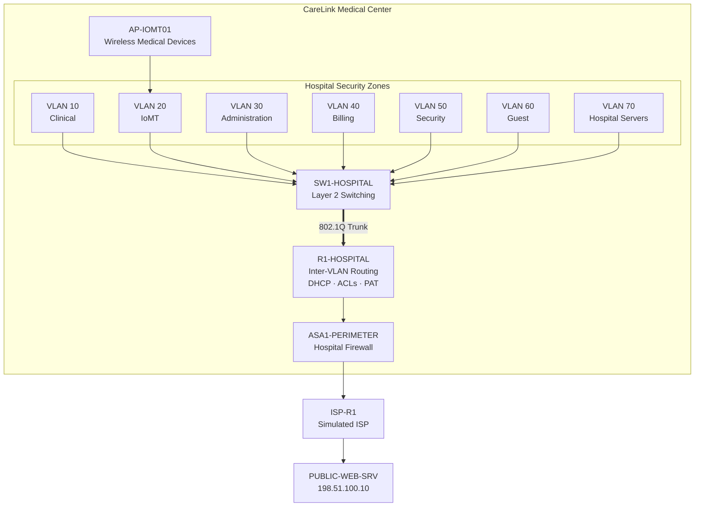
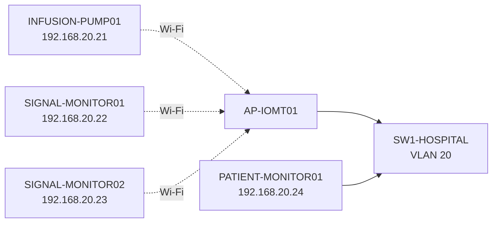
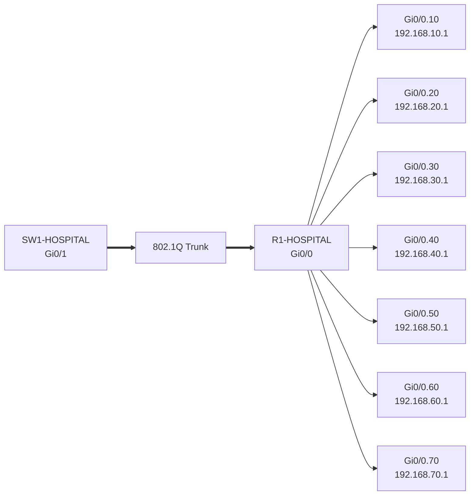
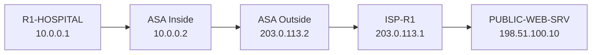

<div align="center">

# CareLink Medical Center
## Network Architecture

**Logical design, segmentation model, addressing, and traffic flow**

<p>
  
  
  
</p>

**[← Back to README](../README.md) · [Security Controls](security-controls.md) · [Threat Model](threat-model.md) · [Validation](test-matrix.md)**

</div>

---

## Architecture Overview

CareLink Medical Center is a simulated hospital network built to demonstrate how network segmentation, routing, wireless IoMT connectivity, and perimeter security can be combined into a healthcare-focused architecture.

The design separates systems by both **business function** and **security trust level**.



---

## Architecture at a Glance

| Layer | Component | Role |
|---|---|---|
| Access | `SW1-HOSPITAL` | VLAN segmentation and endpoint connectivity |
| Wireless | `AP-IOMT01` | Wireless IoMT access |
| Routing | `R1-HOSPITAL` | Inter-VLAN routing, DHCP, ACL enforcement, PAT |
| Perimeter | `ASA1-PERIMETER` | Inside/outside security boundary |
| External | `ISP-R1` | Simulated Internet routing |
| External Service | `PUBLIC-WEB-SRV` | Simulated public application |
| Internal Service | `HOSPITAL-SRV01` | Simulated hospital application server |

---

## Network Segmentation

| VLAN | Security Zone | Network | Gateway | Example Systems |
|---:|---|---|---|---|
| 10 | Clinical | `192.168.10.0/24` | `192.168.10.1` | Nurse / Doctor workstations |
| 20 | IoMT | `192.168.20.0/24` | `192.168.20.1` | Infusion pump / patient monitors |
| 30 | Administration | `192.168.30.0/24` | `192.168.30.1` | Administrative workstation |
| 40 | Billing | `192.168.40.0/24` | `192.168.40.1` | Billing workstation |
| 50 | Security | `192.168.50.0/24` | `192.168.50.1` | SOC workstation |
| 60 | Guest | `192.168.60.0/24` | `192.168.60.1` | Guest laptop |
| 70 | Hospital Servers | `192.168.70.0/24` | `192.168.70.1` | Internal hospital server |

---

## IoMT Architecture

The medical-device environment contains both wired and wireless systems.



Wireless devices associate with `AP-IOMT01`, which bridges them into VLAN 20.

This gives the lab a dedicated IoMT trust zone rather than placing simulated medical devices directly alongside Clinical or Administrative systems.

---

## Router-on-a-Stick Design

`SW1-HOSPITAL` carries all internal VLANs to `R1-HOSPITAL` over a single 802.1Q trunk.



---

## Addressing Strategy

Dynamic addressing is provided by `R1-HOSPITAL`.

Addresses `.1` through `.20` are reserved within client VLANs for infrastructure or future static assignments.

Example:

```text
192.168.10.1      Default gateway
192.168.10.2-20   Reserved
192.168.10.21+    DHCP clients
```

The internal hospital server uses a static address:

```text
HOSPITAL-SRV01
192.168.70.10/24
Gateway: 192.168.70.1
```

---

## Perimeter Architecture

The hospital network connects to the simulated Internet through a dedicated transit network and ASA firewall.



### External Networks

| Purpose | Network |
|---|---|
| R1 ↔ ASA transit | `10.0.0.0/30` |
| ASA ↔ ISP transit | `203.0.113.0/30` |
| Simulated Internet | `198.51.100.0/24` |

---

## Traffic Flow

### Internal

```text
Endpoint
  ↓
SW1-HOSPITAL
  ↓
802.1Q Trunk
  ↓
R1-HOSPITAL
  ↓
Destination VLAN
```

### External

```text
Hospital Endpoint
  ↓
SW1-HOSPITAL
  ↓
R1-HOSPITAL
  ↓
PAT
  ↓
ASA1-PERIMETER
  ↓
ISP-R1
  ↓
PUBLIC-WEB-SRV
```

---

## Design Decisions

| Decision | Reason |
|---|---|
| Separate IoMT VLAN | Reduce medical-device lateral movement |
| Separate Guest VLAN | Isolate unmanaged systems |
| Dedicated Security VLAN | Preserve administrative/monitoring reachability |
| Static Hospital Server | Stable address for policy and testing |
| Router-on-a-Stick | Efficient inter-VLAN routing in Packet Tracer |
| ASA perimeter | Demonstrate firewall trust boundaries |
| PAT | Hide internal addressing and enable simulated Internet access |

---

<details>
<summary><strong>View Packet Tracer implementation</strong></summary>

<br>


</details>

---

## Scope

This architecture is intentionally simplified for educational purposes.

It demonstrates network-security engineering concepts but is not intended to represent a production hospital network, clinical safety design, or compliance-certified healthcare architecture.

---

<div align="center">

**[← Back to Project Overview](../README.md)**

</div>
