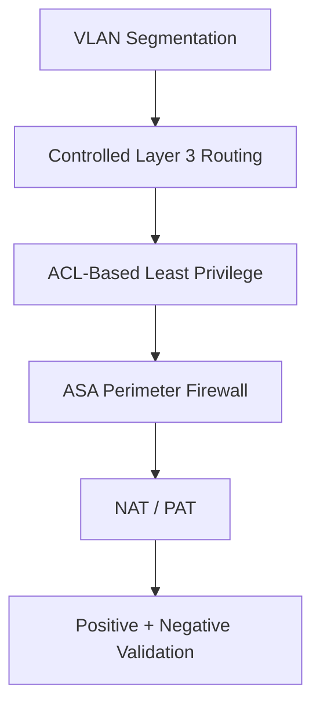
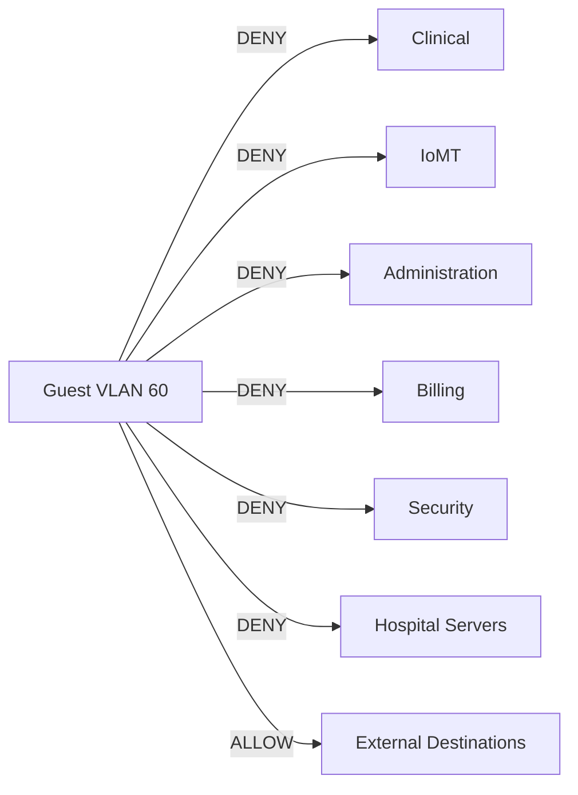
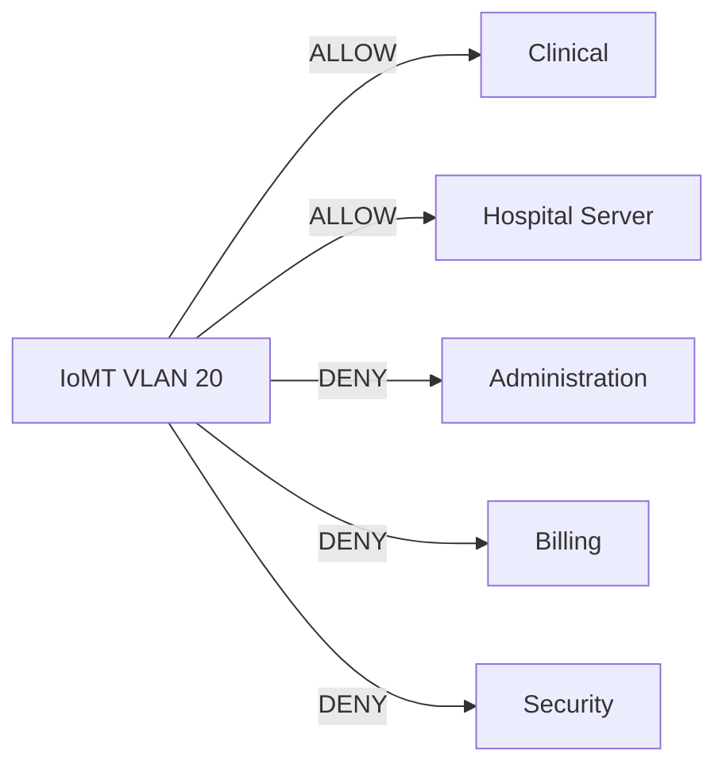
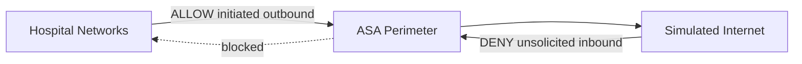
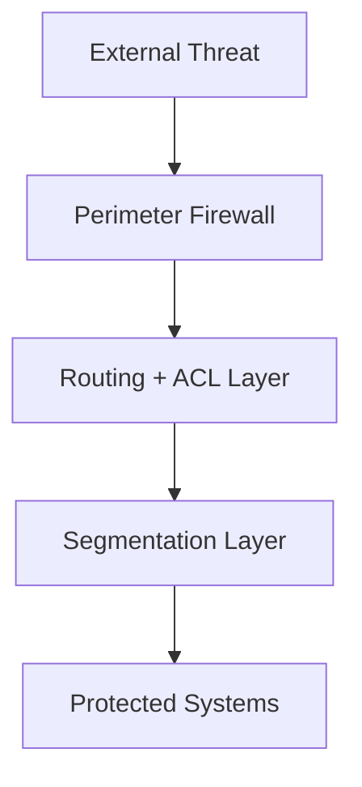

<div align="center">

# CareLink Medical Center
## Security Controls

**Segmentation, least privilege, IoMT isolation, and perimeter protection**

<p>
  
  
  
</p>

**[← README](../README.md) · [Architecture](architecture.md) · [Threat Model](threat-model.md) · [Validation](test-matrix.md)**

</div>

---

## Security Model

The CareLink design uses multiple layers of network security rather than relying on VLAN separation alone.



---

## Control Summary

| Control | Threat Addressed | Status |
|---|---|:---:|
| VLAN Segmentation | Flat-network lateral movement | Pass |
| Guest Isolation | Untrusted guest access | Pass |
| IoMT Isolation | Compromised medical device | Pass |
| Security VLAN | Administrative separation | Pass |
| ASA Perimeter | Internet-originated traffic | Pass |
| NAT/PAT | Internal address exposure | Pass |
| Positive/Negative Tests | Misconfiguration | Pass |

---

## Guest Isolation

### Objective

Prevent unmanaged guest endpoints from communicating with internal hospital systems.

### Policy



### Enforcement

The named ACL:

```text
GUEST-ISOLATION
```

is applied inbound on:

```text
GigabitEthernet0/0.60
```

### Validation

Guest traffic was tested against every internal hospital zone.

All internal attempts were denied, and ACL hit counters confirmed the policy processed the traffic.

---

## IoMT Least Privilege

### Objective

Limit the damage that could result from a compromised medical or IoMT endpoint.

### Policy



### Validation Endpoint

The primary test endpoint was:

```text
INFUSION-PUMP01
192.168.20.21
```

Before ACL enforcement, the device could initiate connections to Admin, Billing, Security, Clinical, and Hospital Server resources.

After ACL enforcement:

| Destination | Result |
|---|:---:|
| Clinical |  Allow |
| Hospital Server |  Allow |
| Administration | Deny |
| Billing |  Deny |
| Security | Deny |

This provides a clear **before-and-after security control demonstration**.

---

## VLAN Segmentation

Seven security zones are used:

```text
VLAN 10  Clinical
VLAN 20  IoMT
VLAN 30  Administration
VLAN 40  Billing
VLAN 50  Security
VLAN 60  Guest
VLAN 70  Hospital Servers
```

VLANs create logical separation, while ACLs define what traffic is permitted between them.

> VLAN segmentation alone is not equivalent to access control.

---

## Wireless IoMT Security

Wireless medical devices connect through `AP-IOMT01`.

The access point is connected to an access port assigned to VLAN 20.

This keeps wireless IoMT devices inside the same controlled trust zone as wired medical equipment.

---

## Security Management Zone

`SOC-WS01` resides in VLAN 50.

The Security VLAN maintains broad reachability for monitoring and administrative tasks while other lower-trust zones are restricted from initiating access toward it.

This models the concept of a privileged management network.

---

## Perimeter Firewall

`ASA1-PERIMETER` separates the hospital network from the simulated Internet.

| Interface | Security Level | Address |
|---|---:|---|
| Inside | 100 | `10.0.0.2/30` |
| Outside | 0 | `203.0.113.2/30` |

The ASA provides:

- trust-boundary enforcement
- inside/outside segmentation
- static routing
- traffic inspection
- restricted inbound behavior

---

## NAT/PAT

PAT is performed by `R1-HOSPITAL`.

Example translation:

```text
Inside local:
192.168.10.21

Inside global:
10.0.0.1
```

This allows internal clients to use external services without exposing their original RFC1918 addresses directly.

---

## Perimeter Policy



Validated behavior:

```text
Hospital → Public Web Server      PASS
Public Web Server → Hospital      BLOCKED
```

---

## Defense-in-Depth View



No single control is treated as sufficient.

---

## Evidence

<details>
<summary><strong>Guest ACL evidence</strong></summary>

<br>


</details>

<details>
<summary><strong>IoMT ACL evidence</strong></summary>

<br>


</details>

<details>
<summary><strong>NAT/PAT evidence</strong></summary>

<br>


</details>

---

<div align="center">

**[← Back to Project Overview](../README.md)**

</div>
