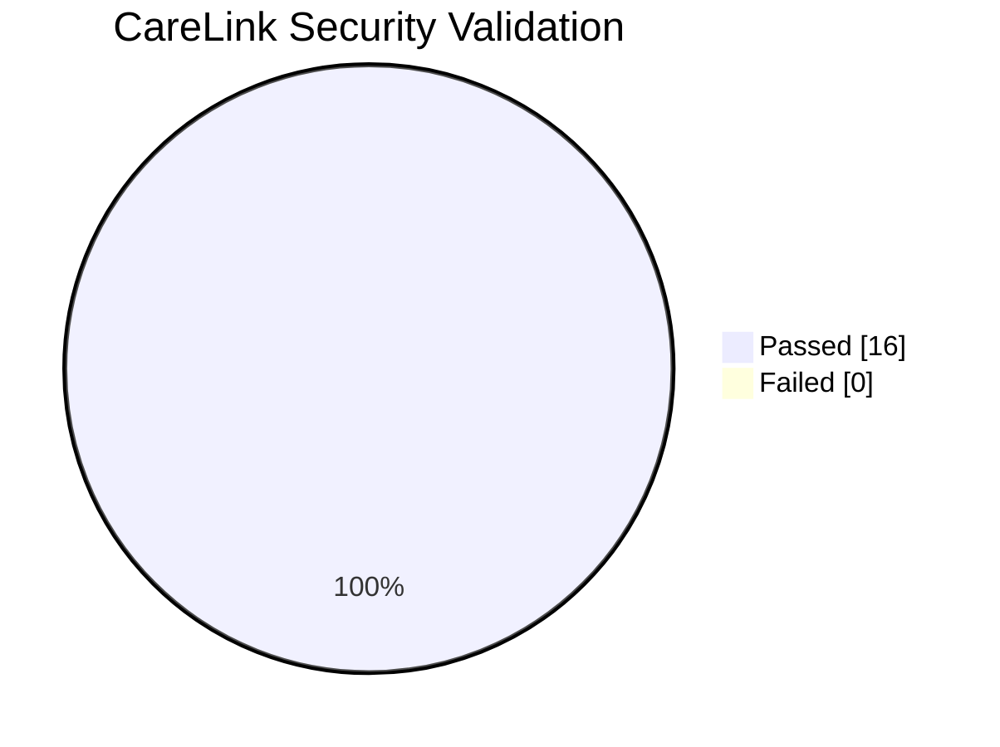
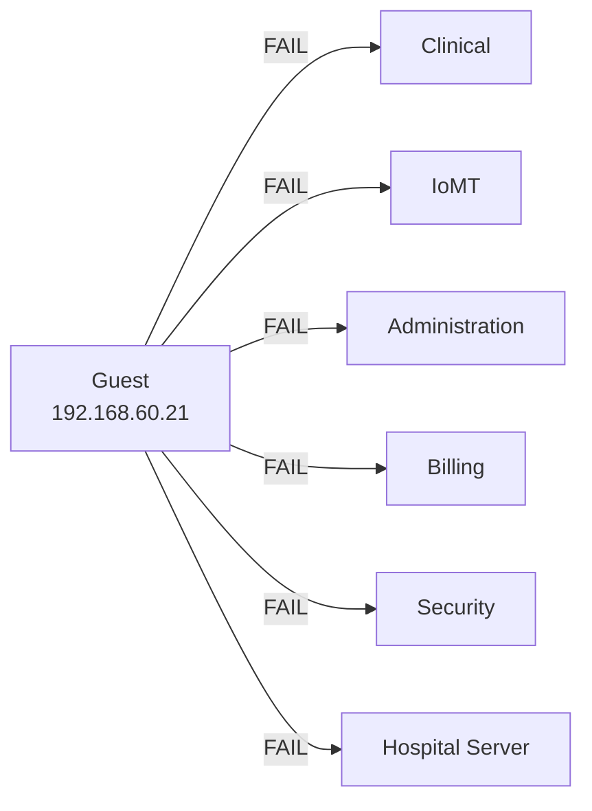
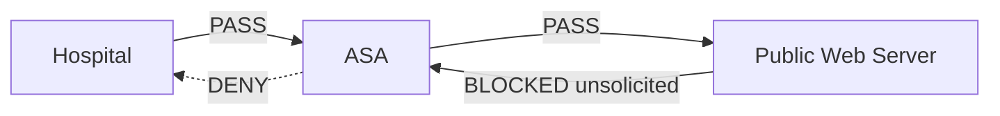

<div align="center">

# CareLink Medical Center
## Security Validation Matrix

**Positive controls, negative controls, and evidence-based verification**

<p>
  
  
  
</p>

**[← README](../README.md) · [Architecture](architecture.md) · [Security Controls](security-controls.md) · [Troubleshooting](troubleshooting.md)**

</div>

---

## Validation Strategy

The network was tested using both:

**Positive controls** — traffic that should succeed.

**Negative controls** — traffic that should be denied.

This avoids treating connectivity alone as proof of correct security behavior.

---

## Overall Result



---

## Test Matrix

| ID | Category | Source | Destination | Expected | Result |
|---|---|---|---|---|:---:|
| T01 | Clinical | Clinical | Hospital Server | Allow |  PASS |
| T02 | Guest | Guest | Clinical | Deny | PASS |
| T03 | Guest | Guest | IoMT | Deny |  PASS |
| T04 | Guest | Guest | Administration | Deny |  PASS |
| T05 | Guest | Guest | Billing | Deny |  PASS |
| T06 | Guest | Guest | Security | Deny |  PASS |
| T07 | Guest | Guest | Hospital Server | Deny |  PASS |
| T08 | IoMT | IoMT | Administration | Deny |  PASS |
| T09 | IoMT | IoMT | Billing | Deny |  PASS |
| T10 | IoMT | IoMT | Security | Deny |  PASS |
| T11 | IoMT | IoMT | Clinical | Allow |  PASS |
| T12 | IoMT | IoMT | Hospital Server | Allow |  PASS |
| T13 | Security | SOC | IoMT | Allow | PASS |
| T14 | Perimeter | Clinical | Public Web Server | Allow | PASS |
| T15 | Perimeter | Security | Public Web Server | Allow | PASS |
| T16 | Perimeter | Public Web Server | Hospital Server | Deny |  PASS |

---

## Guest Isolation Validation



Result:

```text
6/6 expected denies passed
```

<details>
<summary><strong>Evidence</strong></summary>

<br>


</details>

---

## IoMT Validation

Primary test endpoint:

```text
INFUSION-PUMP01
192.168.20.21
```

| Destination | Before ACL | After ACL |
|---|:---:|:---:|
| Administration | ✅ | ❌ |
| Billing | ✅ | ❌ |
| Security | ✅ | ❌ |
| Clinical | ✅ | ✅ |
| Hospital Server | ✅ | ✅ |

This demonstrates an actual **security-state change**, not just static configuration.

<details>
<summary><strong>Evidence</strong></summary>

<br>


</details>

---

## Perimeter Validation



Validated outcomes:

```text
Hospital → Internet      PASS
Internet → Hospital      DENY
```

---

## Verification Methods

| Method | Purpose |
|---|---|
| `ping` | Layer 3 reachability |
| HTTP | Application connectivity |
| `show vlan brief` | VLAN membership |
| `show interfaces trunk` | Trunk verification |
| `show ip dhcp binding` | DHCP verification |
| `show access-lists` | ACL policy and counters |
| `show ip route` | Routing validation |
| `show ip nat translations` | PAT validation |
| Packet Tracer Simulation Mode | Hop-by-hop packet analysis |

---

## Evidence Gallery

<details>
<summary><strong>VLANs</strong></summary>

<br>


</details>

<details>
<summary><strong>802.1Q Trunk</strong></summary>

<br>


</details>

<details>
<summary><strong>DHCP</strong></summary>

<br>


</details>

<details>
<summary><strong>NAT/PAT</strong></summary>

<br>


</details>

<details>
<summary><strong>Outbound Web Access</strong></summary>

<br>


</details>

---

## Final Validation Status

> **All documented security tests produced the expected result.**

---

<div align="center">

**[← Back to Project Overview](../README.md)**

</div>
