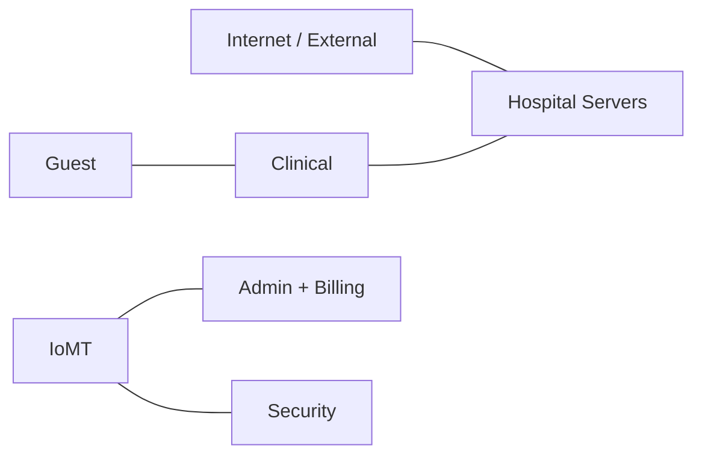
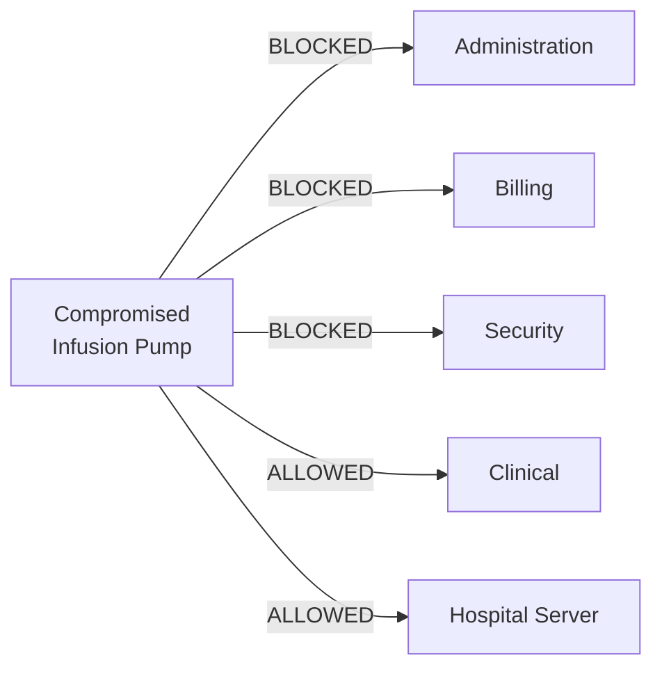
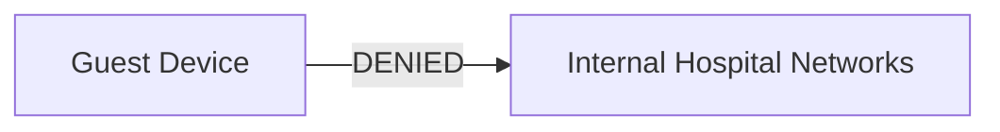
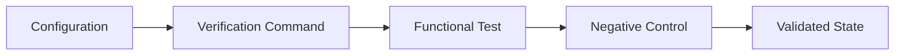

<div align="center">

# CareLink Medical Center
## Threat Model

**Assets, trust boundaries, representative threats, and mitigations**

<p>
  
  
  
</p>

**[← README](../README.md) · [Architecture](architecture.md) · [Security Controls](security-controls.md) · [Validation](test-matrix.md)**

</div>

---

## Threat Model Overview

The CareLink threat model focuses on representative network-level threats that are relevant to a hospital environment.

The primary question is:

> If one device or trust zone is compromised, how much of the hospital network can it reach?

---

## Protected Assets

| Asset | Security Concern |
|---|---|
| Clinical Workstations | Clinical workflow disruption |
| IoMT Devices | Device compromise and pivoting |
| Administration | Sensitive operational information |
| Billing | Financial and payment-related data |
| Hospital Servers | Central application availability |
| Security Workstations | Privileged monitoring capability |
| Network Infrastructure | Full environment availability |

---

## Trust Boundaries



The major trust boundaries are:

1. External network ↔ hospital
2. Guest ↔ internal hospital
3. IoMT ↔ business systems
4. IoMT ↔ security management
5. Clinical ↔ hospital services

---

## Threat Scenario 1 — Compromised IoMT Device

### Scenario

An attacker compromises a vulnerable infusion pump.



### Risk

Without segmentation, the medical device could become a pivot point into unrelated business systems.

### Mitigations

- dedicated VLAN 20
- IoMT ACL
- restricted administrative reachability
- limited approved communication paths

### Residual Risk

The device can still communicate with approved Clinical and Hospital Server resources.

Production environments would normally restrict those flows further by protocol and destination.

---

## Threat Scenario 2 — Guest Lateral Movement

### Scenario

An unmanaged guest endpoint attempts to scan or access hospital systems.

### Risk

A flat guest network could expose Clinical, IoMT, Billing, or server resources.

### Mitigation

`GUEST-ISOLATION` denies Guest → internal hospital communication.



---

## Threat Scenario 3 — Ransomware Propagation

### Scenario

A workstation becomes infected and attempts lateral movement.

### Risk

A flat network would allow malware to discover and interact with unrelated systems.

### Mitigations

- VLAN segmentation
- ACL enforcement
- separation of IoMT, Guest, Clinical, Billing, and Security systems
- perimeter isolation

---

## Threat Scenario 4 — Internet-Originated Access

### Scenario

An external host attempts to reach the internal hospital server directly.

### Test

```text
PUBLIC-WEB-SRV → 192.168.70.10
```

### Result

```text
DENIED
```

### Mitigation

The hospital server is not directly exposed through the simulated perimeter.

---

## Threat Scenario 5 — Network Misconfiguration

### Scenario

An incorrect VLAN assignment, ACL, route, gateway, or NAT rule weakens security or causes an outage.

### Risk

Misconfiguration can either:

- accidentally expose sensitive networks, or
- disrupt legitimate hospital communication.

### Mitigations



The project was deliberately built incrementally and validated after each major configuration stage.

---

## Risk Matrix

| Threat | Likelihood | Impact | Primary Control |
|---|---|---|---|
| Guest lateral movement | Medium | High | Guest ACL |
| Compromised IoMT device | Medium | High | IoMT ACL |
| Internet-originated access | Medium | High | ASA perimeter |
| Network misconfiguration | Medium | High | Incremental testing |
| Ransomware propagation | Medium | Critical | Segmentation |
| Security-zone compromise | Low | Critical | Management separation |

> Ratings are qualitative and used only for the educational scenario.

---

## Security Assumptions

This model assumes:

- trusted internal network infrastructure
- no malicious switch/router administrator
- no Layer 2 attacks
- no endpoint EDR or host firewall simulation
- no real EHR, PACS, pharmacy, or biomedical platform
- no production medical-device protocols

---

## Out of Scope

The following are intentionally outside this lab:

- identity and access management
- NAC / 802.1X
- SIEM
- endpoint detection and response
- microsegmentation
- TLS inspection
- real HIPAA compliance controls
- clinical safety engineering

---

<div align="center">

**[← Back to Project Overview](../README.md)**

</div>
