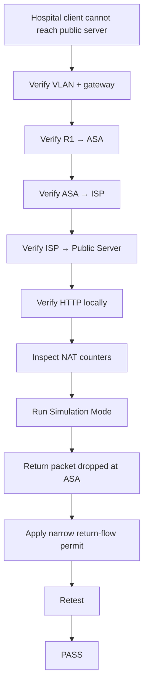
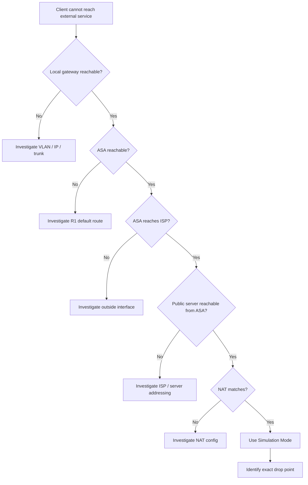

<div align="center">

# CareLink Medical Center
## Troubleshooting Case Study

**Diagnosing an ASA return-path failure using layered verification and Packet Tracer Simulation Mode**

<p>
  
  
  
</p>

**[← README](../README.md) · [Architecture](architecture.md) · [Security Controls](security-controls.md) · [Validation](test-matrix.md)**

</div>

---

## Incident Summary

During perimeter testing, internal hospital endpoints were unable to complete connections to the simulated public server.

The public server itself was operational, routing was present, and NAT rules were matching traffic.

The failure required hop-by-hop analysis of both the forward and return paths.

---

## Symptom

```text
NURSE-WS01
192.168.10.21

        ↓

http://198.51.100.10

        ↓

REQUEST TIMEOUT
```

SOC traffic demonstrated the same behavior, confirming the issue was not isolated to the Clinical VLAN.

---

## Investigation Timeline



---

## Phase 1 — Internal Network Validation

The internal hospital environment was verified first.

| Check | Result |
|---|:---:|
| VLANs active | ✅ |
| 802.1Q trunk active | ✅ |
| R1 subinterfaces up/up | ✅ |
| DHCP working | ✅ |
| Inter-VLAN routing working | ✅ |

This ruled out the switching and internal-routing layers.

---

## Phase 2 — Perimeter Validation

The perimeter was tested incrementally.

```text
R1 → ASA                    PASS
ASA → ISP                   PASS
ISP → Public Server         PASS
ASA → Public Server         PASS
Public Server HTTP          PASS
```

The failure affected only **transit traffic originating inside the hospital**.

---

## Phase 3 — NAT Investigation

PAT was verified using:

```text
show ip nat translations
show ip nat statistics
```

Example translation:

```text
Inside local:   192.168.10.21
Inside global:  10.0.0.1
Destination:    198.51.100.10
```

NAT hits increased during testing.

This proved that the internal traffic was reaching the translation layer.

---

## Phase 4 — Packet-Level Analysis

Packet Tracer Simulation Mode was then used to observe the entire transaction.

### Forward Path


The forward packet reached the public server successfully.

### Return Path

```mermaid
flowchart LR
    W["PUBLIC-WEB-SRV"]
    I["ISP-R1"]
    A["ASA"]
    R["R1-HOSPITAL"]

    W --> I --> A
    A -- "DROP" -.-> R
```

The returning packet reached the ASA and was discarded.

This was the decisive observation.

---

## Root Cause

Packet Tracer reported that the ASA was treating the return flow as traffic moving from:

```text
lower-security interface
        ↓
higher-security interface
```

and required an explicit extended ACL permit.

This behavior differs from what would normally be expected from stateful return traffic on a production ASA.

---

## Resolution

A narrowly scoped ACL was introduced to permit the required return flow in the simulation.

The rule was intentionally limited rather than broadly allowing outside-to-inside traffic.

After the change:

```text
R1 → Public Server        5/5 PASS
Nurse → Public Server     PASS
HTTP → Public Server      PASS
```

---

## Troubleshooting Decision Tree



---

## Key Lessons

### 1. Validate one layer at a time

Changing VLANs, routes, NAT, and ACLs simultaneously would have made the failure much harder to isolate.

### 2. Check the return path

A successful forward path does not guarantee a successful session.

### 3. Counters are evidence

NAT and ACL counters helped prove that packets were reaching specific controls.

### 4. Simulation Mode was decisive

The packet-level visualization exposed the ASA as the exact return-path failure point.

### 5. Simulator behavior matters

Packet Tracer is useful for learning, but its ASA implementation does not reproduce every production-device behavior.

---

## Before vs After

| Stage | Result |
|---|:---:|
| Internal → Public Server before fix | Failed |
| ASA → Public Server | Pass |
| Public Server local HTTP | Pass |
| Return packet reaches ASA | Pass |
| Return packet passes ASA before fix | Failed |
| Return packet passes ASA after fix | Pass |
| End-to-end HTTP after fix | Pass |

---

<details>
<summary><strong>Related Evidence</strong></summary>

<br>

### ASA Routing


### NAT/PAT


### Successful Web Access


</details>

---

## Engineering Takeaway

The most valuable part of the exercise was not the final ACL command.

It was the diagnostic process:

```text
Observe
  ↓
Isolate
  ↓
Verify
  ↓
Trace
  ↓
Identify
  ↓
Correct
  ↓
Retest
```

That workflow is transferable to real network-security troubleshooting.

---

<div align="center">

**[← Back to Project Overview](../README.md)**

</div>
Cisco Packet Tracer Simulation Mode was used to follow packets hop-by-hop.

The outbound packet successfully followed:

`R1-HOSPITAL → ASA1-PERIMETER → ISP-R1 → PUBLIC-WEB-SRV`

The return packet followed:

`PUBLIC-WEB-SRV → ISP-R1 → ASA1-PERIMETER`

and was dropped at the ASA.

### Root Cause

The Packet Tracer ASA simulation treated the returning traffic entering the lower-security `outside` interface and leaving the higher-security `inside` interface as requiring an explicit extended ACL permit.

### Resolution

A narrowly scoped outside ACL was introduced for the required simulated return flow.

R1-HOSPITAL was used for PAT to simplify the Packet Tracer forwarding path.

### Lessons Learned

The troubleshooting process reinforced several principles:

1. Verify each network layer independently.
2. Avoid changing multiple controls simultaneously.
3. Use packet-level simulation to identify the exact failure point.
4. Validate both forward and return paths.
5. Treat simulator-specific behavior separately from real-device behavior.
